# 🔐 xsukax Local Network Call

A privacy-focused, end-to-end encrypted WebRTC video calling application designed specifically for local networks, VPN environments, and private infrastructure. Built as a single PHP file with zero external dependencies, this application provides secure peer-to-peer video communication with AES-256 encrypted signaling and DTLS-SRTP media encryption.

**Demo:** [https://xsukax.ct.ws/call](https://xsukax.ct.ws/call)

[](https://www.gnu.org/licenses/gpl-3.0)
[](https://www.php.net/)
[](https://webrtc.org/)

## 📋 Project Overview

xsukax Local Network Call is a self-hosted, privacy-centric video calling solution that operates entirely within your controlled network environment. Unlike cloud-based services, this application keeps all signaling data within your infrastructure while establishing direct peer-to-peer connections for media streams. The entire application is contained in a single PHP file, making deployment and maintenance remarkably simple.

**Primary Use Cases:**
- Secure video calls over OpenVPN networks
- Private communication within Tailscale meshes
- Corporate intranet video conferencing
- Home network video calls
- Any scenario requiring zero third-party involvement

The application implements a room-based architecture where a host creates an encrypted room, shares the link and password separately, and guests join by decrypting the connection information using the shared password.

## 🛡️ Security and Privacy Benefits

### Zero-Knowledge Architecture
The server never has access to room passwords or the ability to decrypt signaling data. All encryption and decryption occur client-side in the browser, ensuring that even the server administrator cannot intercept or decrypt communication metadata.

### Multi-Layer Encryption


**Signaling Encryption:**
- AES-256-GCM encryption for all WebRTC signaling data (offers, answers, ICE candidates)
- PBKDF2 key derivation with 100,000 iterations and random salts
- Unique initialization vectors (IV) for each encryption operation
- Authenticated encryption preventing tampering

**Media Encryption:**
- DTLS-SRTP (Datagram Transport Layer Security - Secure Real-time Transport Protocol) for all audio and video streams
- Direct peer-to-peer connections bypass the server entirely
- Forward secrecy through ephemeral key exchange

### Privacy Protections

**Data Minimization:**
- No user accounts or authentication required
- No personal information collected or stored
- Room data automatically expires after one hour
- No logging of connection attempts or user activity

**Network Privacy:**
- Operates entirely within your local network or VPN
- Compatible with OpenVPN, Tailscale, WireGuard, and standard LANs
- No external dependencies or third-party services
- STUN server used only for NAT traversal (no media relay)

**Isolation Benefits:**
- Complete control over infrastructure
- No data leakage to external services
- Compliance-friendly for regulated industries
- Audit trail stays within your network

## ✨ Features and Advantages

### Core Capabilities
- **Single-File Deployment**: Entire application in one PHP file - no complex setup or dependency management
- **Password-Protected Rooms**: Cryptographically secure room access control with separate password channel recommendation
- **HD Video Quality**: Support for SD (640×480), HD (1280×720), and Full HD (1920×1080) resolution options
- **Responsive Design**: Fully optimized mobile interface with touch controls and safe area support
- **Audio/Video Controls**: Toggle camera, microphone, self-view, and audio-only mode during calls
- **Draggable Preview**: Repositionable local video preview that stays out of your way
- **Fullscreen Mode**: Immersive calling experience on any device
- **Auto Room Cleanup**: Automatic removal of expired rooms (configurable 1-hour default)

### Technical Advantages
- **Zero Database Required**: File-based storage using JSON - simplifies backup and reduces attack surface
- **Minimal Server Load**: Signaling-only server role - media flows peer-to-peer
- **Cross-Platform**: Works on Windows, macOS, Linux, iOS, Android via modern browsers
- **GitHub-Inspired UI**: Clean, professional interface familiar to developers
- **Progressive Enhancement**: Graceful degradation for older browsers
- **Network Agnostic**: Functions on any IP network - LAN, VPN, or internet

### Operational Benefits
- **Easy Deployment**: Copy one file to web server and start calling
- **Low Maintenance**: No database migrations or complex updates
- **Portable**: Move between servers with a simple file copy
- **Self-Contained**: No external CDN dependencies for core functionality (only Tailwind CSS)
- **Debuggable**: Single file makes troubleshooting straightforward

## 🚀 Installation Instructions

### Prerequisites
- Web server with PHP 7.4 or higher (Apache, Nginx, Caddy, etc.)
- HTTPS connection (required for WebRTC camera/microphone access)
- Modern web browser with WebRTC support

### Step 1: Download the Application
```bash
# Clone the repository
git clone https://github.com/xsukax/xsukax-Local-Network-Call.git

# Navigate to the directory
cd xsukax-Local-Network-Call
```

### Step 2: PHP Configuration

Ensure your `php.ini` file has the following settings configured:

```ini
# File upload and POST data limits (for signaling data)
post_max_size = 8M
upload_max_filesize = 8M

# Execution time (for long-polling signaling)
max_execution_time = 60

# Memory limit
memory_limit = 128M

# Enable JSON extension (usually enabled by default)
extension=json

# File operations
file_uploads = On
allow_url_fopen = On
```

### Step 3: Deploy to Web Server

**Option A: Apache**
```bash
# Copy to web root
sudo cp index.php /var/www/html/call.php

# Set appropriate permissions
sudo chown www-data:www-data /var/www/html/call.php
sudo chmod 644 /var/www/html/call.php

# Create data directory
sudo mkdir /var/www/html/vpn_call_data
sudo chown www-data:www-data /var/www/html/vpn_call_data
sudo chmod 755 /var/www/html/vpn_call_data
```

**Option B: Nginx**
```bash
# Copy to web root
sudo cp index.php /usr/share/nginx/html/call.php

# Set appropriate permissions
sudo chown nginx:nginx /usr/share/nginx/html/call.php
sudo chmod 644 /usr/share/nginx/html/call.php

# Ensure PHP-FPM is configured
# Data directory will be auto-created by the application
```

**Option C: Development Server**
```bash
# Quick test with PHP built-in server
php -S 0.0.0.0:8080 index.php
```

### Step 4: Configure HTTPS

WebRTC requires HTTPS for camera and microphone access. For local networks:

**Self-Signed Certificate (Development):**
```bash
# Generate certificate
openssl req -x509 -nodes -days 365 -newkey rsa:2048 \
  -keyout selfsigned.key -out selfsigned.crt

# Configure your web server to use the certificate
```

**Let's Encrypt (Production):**
```bash
# For public domains
sudo certbot --apache -d yourdomain.com
# or
sudo certbot --nginx -d yourdomain.com
```

**Tailscale HTTPS:**
```bash
# Tailscale provides automatic HTTPS certificates
tailscale cert yourhostname.tailnet-name.ts.net
```

### Step 5: Access the Application

Navigate to your server's address:
- Local network: `https://192.168.1.100/call.php`
- OpenVPN: `https://10.8.0.1/call.php`
- Tailscale: `https://hostname.tailnet.ts.net/call.php`

## 📖 Usage Guide

### Creating a Secure Room


**Step-by-Step Process:**

1. **Host Creates Room:**
   - Open the application in your browser
   - Enter a strong password (minimum 6 characters, recommend 12+)
   - Select desired video quality (SD, HD, or Full HD)
   - Click "🚀 Create Encrypted Room"
   - Grant browser permissions for camera and microphone
   - Copy the generated room link

2. **Secure Password Sharing:**
   - Send the room link via one channel (email, Slack, etc.)
   - Send the password via a **different channel** (SMS, Signal, phone call)
   - This ensures compromise of one channel doesn't expose both pieces

3. **Guest Joins:**
   - Open the room link in a browser
   - Enter the password provided by the host
   - Grant camera and microphone permissions
   - Click "📞 Decrypt & Join Call"
   - Wait for peer-to-peer connection establishment

### During the Call

**Call Controls:**

```mermaid
graph LR
    A[🎥 Toggle Camera] --> B{Video State}
    B -->|On| C[Stream Video]
    B -->|Off| D[Audio Only]
    
    E[🎤 Toggle Mic] --> F{Audio State}
    F -->|On| G[Stream Audio]
    F -->|Off| H[Muted]
    
    I[👁️ Hide Self] --> J[Hide Local Preview]
    K[🎵 Audio Mode] --> L[Disable Both Videos]
    M[⛶ Fullscreen] --> N[Immersive View]
    O[📞 Hangup] --> P[End Call]
```



**Available Controls:**
- **🎥 Camera Toggle**: Turn video on/off (activates audio-only mode when off)
- **🎤 Microphone Toggle**: Mute/unmute audio
- **👁️ Hide Self View**: Hide your local video preview while keeping it active for the other person
- **🎵 Audio Only Mode**: Disable video for both users, reduces bandwidth
- **⛶ Fullscreen**: Enter fullscreen mode for immersive experience
- **📞 Hangup**: End the call and disconnect

**Local Video Preview:**
- Drag the small preview window to any position on screen
- Automatically stays within screen boundaries
- Hidden in audio-only mode
- Can be manually hidden with the eye icon

### Network Compatibility

The application works seamlessly with various network configurations:

**OpenVPN Setup:**
```bash
# Hosts can access via OpenVPN IP
https://10.8.0.5/call.php

# Ensure web server listens on VPN interface
# Apache: Listen 10.8.0.5:443
# Nginx: listen 10.8.0.5:443 ssl;
```

**Tailscale Setup:**
```bash
# Access via Tailscale hostname
https://myserver.tailnet-name.ts.net/call.php

# Tailscale provides automatic HTTPS and mesh routing
# No additional configuration needed
```

**Local Network:**
```bash
# Standard LAN access
https://192.168.1.50/call.php

# Ensure firewall allows HTTPS (port 443)
sudo ufw allow 443/tcp
```

### Troubleshooting

**Connection Issues:**


**Common Solutions:**
- **"Failed to access media devices"**: Grant camera/microphone permissions in browser
- **"Wrong password or corrupted data"**: Ensure exact password match (case-sensitive)
- **Room expired**: Rooms auto-delete after 1 hour, create a new one
- **No video showing**: Check camera is not being used by another application
- **Connection stuck**: Refresh both browsers and try again

## 🔧 Advanced Configuration

### Customizing Room Expiry

Edit the `ROOM_EXPIRY` constant in `index.php`:

```php
// Default: 1 hour (3600 seconds)
define('ROOM_EXPIRY', 3600);

// Change to 30 minutes
define('ROOM_EXPIRY', 1800);

// Change to 4 hours
define('ROOM_EXPIRY', 14400);
```

### Custom Data Directory

Change the storage location:

```php
// Default: same directory as index.php
define('DATA_DIR', __DIR__ . '/vpn_call_data');

// Custom path
define('DATA_DIR', '/var/lib/vpn_call_data');
```

### Adjusting Video Constraints

Modify the JavaScript constraints in the `initializeMedia()` function to customize video quality parameters, audio processing, or frame rates.

## 📄 License

This project is licensed under the GNU General Public License v3.0.

## 🤝 Contributing

Contributions, issues, and feature requests are welcome! Feel free to check the [issues page](https://github.com/xsukax/xsukax-Local-Network-Call/issues).

## 🔗 Links

- **Repository**: [https://github.com/xsukax/xsukax-Local-Network-Call](https://github.com/xsukax/xsukax-Local-Network-Call)
- **WebRTC Documentation**: [https://webrtc.org/](https://webrtc.org/)
- **OpenVPN**: [https://openvpn.net/](https://openvpn.net/)
- **Tailscale**: [https://tailscale.com/](https://tailscale.com/)

---

**Built with 🔐 by xsukax** | Secure, Private, Self-Hosted
